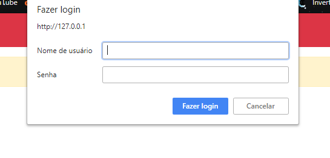
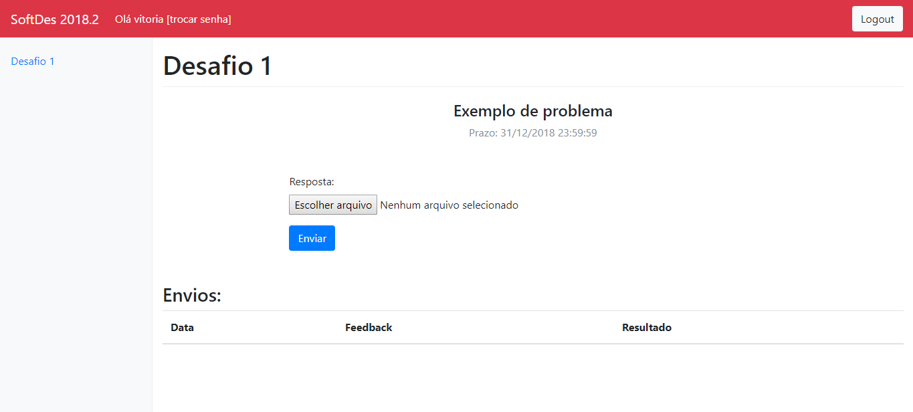
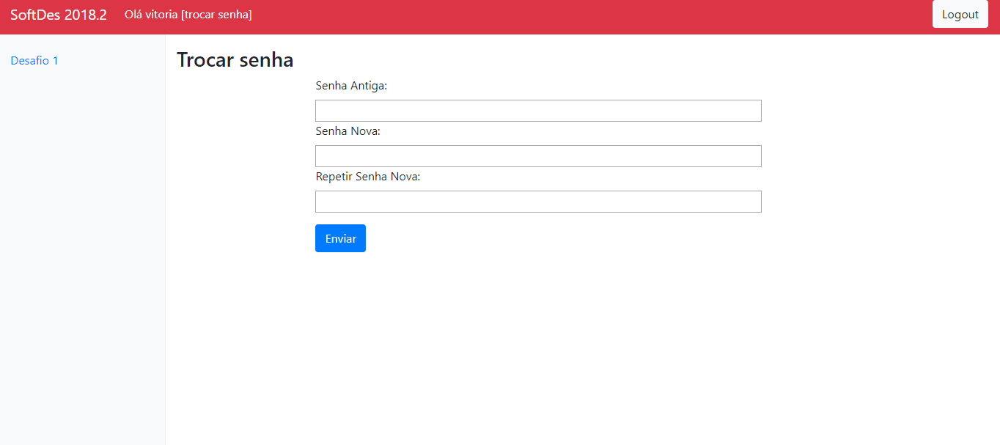

# Manual do usuário

#### Aqui você vai aprender mais sobre as principais funções do WebApp e como utiliza-las.

## Login

* Para acessar sua conta, insira seu nome de usuário e senha nos campos requisitados. 

## Página inicial

* Clicando no botão Escolher arquivo você pode navegar pelos diretórios do seu computador e escolher o arquivo que quer enviar ao professor. 
* O botão Enviar, manda seu arquivo.
* Em Envios você pode checar a data de envio, o feedback e o resultado dos exercícios que você já enviou.
* No botão trocar senha, ao lado do seu nome na barra superior você pode alterar a senha da sua conta e clicando no botão Logout você sai da sua conta na aplicação.

## Trocar senha

* Se deseja trocar sua senha você deve inserir a senha antiga no primeiro campo, e a nova senha no segundo e terceiro campo, e clicar em enviar.